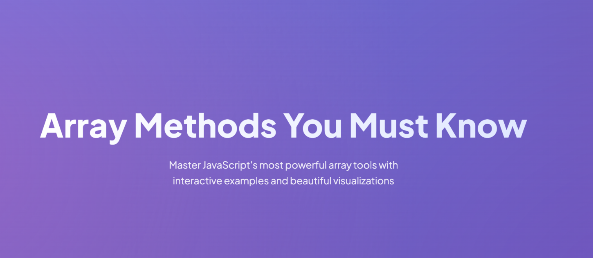
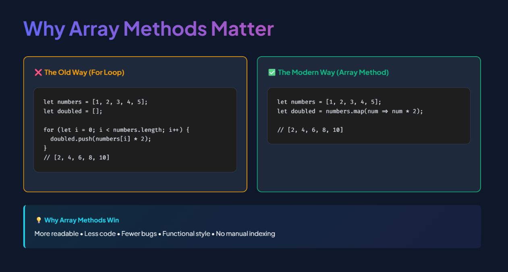

# 📚 JavaScript Array Methods: Interactive Visual Guide


A beautifully crafted, interactive learning resource that makes mastering JavaScript array methods fun and intuitive. Perfect for beginners and experienced developers alike!

## ✨ Live Demo

🔗 **[View Live Demo](https://js-array-methods-guide.netlify.app/)** 

## 🎯 What You'll Learn

This interactive guide covers **20+ essential array methods** with:

- 🎨 **Beautiful Visualizations** - See arrays transform in real-time
- 🎮 **Interactive Demos** - Click and play with live examples
- 📊 **Flowcharts & Diagrams** - Understand the logic visually
- 💡 **Real-World Examples** - Practical use cases you'll actually use
- 🎯 **Practice Challenges** - Test your skills with 4 coding exercises

## 📖 Methods Covered

### Add/Remove Elements
- `push()` - Add to end
- `pop()` - Remove from end
- `shift()` - Remove from start
- `unshift()` - Add to start
- `splice()` - Remove/insert anywhere

### Transform Arrays
- `map()` - Transform each element
- `filter()` - Keep matching elements
- `reduce()` - Accumulate to single value

### Find Elements
- `find()` - Find first matching element
- `findIndex()` - Find index of match
- `includes()` - Check if element exists
- `indexOf()` - Get element index

### Test Conditions
- `some()` - Test if any pass
- `every()` - Test if all pass

### Utilities
- `forEach()` - Iterate without return
- `slice()` - Extract portion (copy)
- `concat()` - Merge arrays
- `join()` - Convert to string
- `sort()` - Sort elements
- `reverse()` - Reverse order

## 🚀 Features

✅ **Interactive Visual Demos** - Click to see methods in action  
✅ **Animated Flowcharts** - Step-by-step process visualization  
✅ **Before/After Comparisons** - Traditional loops vs modern methods  
✅ **Color-Coded Elements** - Visual feedback for transformations  
✅ **Practice Challenges** - Hands-on coding exercises  
✅ **Quick Reference Table** - All methods at a glance  
✅ **Decision Tree** - Which method to use when  
✅ **Mobile Responsive** - Works on all devices  
✅ **Zero Dependencies** - Pure HTML/CSS/JS  

## 💻 Getting Started

### View Online
Simply visit the [Live Demo](https://js-array-methods-guide.netlify.app/)

### Run Locally

```bash
# Clone the repository
git clone https://github.com/humanity2003/array-methods-guide.git

# Navigate to the directory
cd array-methods-guide

# Open in your browser
# On Mac:
open array-methods-interactive.html

# On Windows:
start array-methods-interactive.html

# On Linux:
xdg-open array-methods-interactive.html
```

That's it! No build process, no dependencies, no setup needed.

## 🎨 Screenshots








## 📚 Who Is This For?

- 🎓 **Beginners** learning JavaScript array methods
- 👨‍🏫 **Educators** teaching JavaScript fundamentals
- 💼 **Bootcamp Students** preparing for technical interviews
- 🔄 **Career Switchers** transitioning from other languages
- 📖 **Anyone** wanting a beautiful visual reference

## 🎯 Learning Path

1. **Start with Basics** - push, pop, shift, unshift
2. **Master Transformations** - map, filter, reduce
3. **Learn Finding** - find, includes, indexOf
4. **Practice Testing** - some, every
5. **Complete Challenges** - 4 hands-on exercises
6. **Use Decision Tree** - Build intuition for method selection

## 🤝 Contributing

Contributions are welcome! Here's how you can help:

1. **Report Bugs** - Open an issue if you find any problems
2. **Suggest Features** - Have ideas? Share them!
3. **Improve Documentation** - Fix typos, clarify explanations
4. **Add Examples** - Share real-world use cases
5. **Submit Pull Requests** - Fix bugs or add features

### How to Contribute

```bash
# Fork the repository
# Clone your fork
git clone https://github.com/humanity2003/array-methods-guide.git

# Create a branch
git checkout -b feature/your-feature-name

# Make your changes
# Commit your changes
git commit -m "Add: your feature description"

# Push to your fork
git push origin feature/your-feature-name

# Open a Pull Request
```

## 📄 License

This project is licensed under the MIT License - see the [LICENSE](LICENSE) file for details.

## 🙏 Acknowledgments

- **Design Inspiration** - Modern web design trends
- **Fonts** - Google Fonts (Plus Jakarta Sans, Fira Code, Space Mono)
- **Icons** - Emoji for universal understanding
- **Community** - JavaScript developers worldwide

## 🔗 Related Resources

- [MDN Array Reference](https://developer.mozilla.org/en-US/docs/Web/JavaScript/Reference/Global_Objects/Array)
- [JavaScript.info Arrays](https://javascript.info/array-methods)
- [freeCodeCamp](https://www.freecodecamp.org/learn/javascript-algorithms-and-data-structures/)
- [Eloquent JavaScript](https://eloquentjavascript.net/)

## 📬 Contact

Have questions or suggestions? Feel free to:
- 🐛 [Open an Issue](https://github.com/humanity2003/array-methods-guide/issues)
- 💬 Start a Discussion
- ⭐ Star this repo if you found it helpful!

## ⭐ Show Your Support

If this helped you learn JavaScript array methods, please give it a star ⭐

It helps others discover this resource and motivates continued development!

---

**Made with ❤️ for the JavaScript community**

*Happy coding! 🚀*
